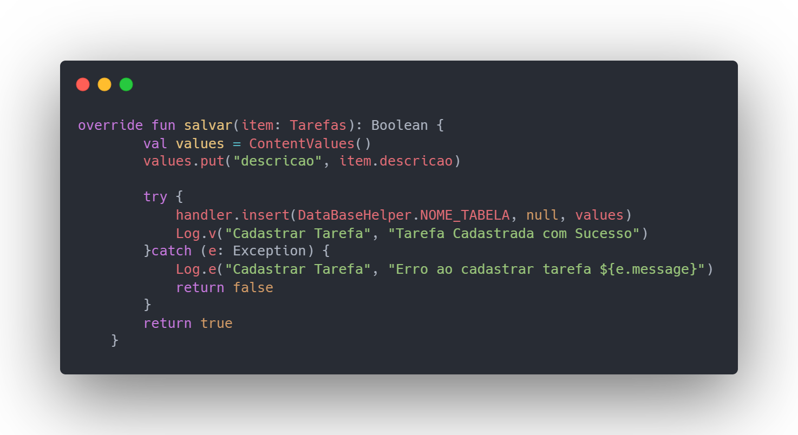
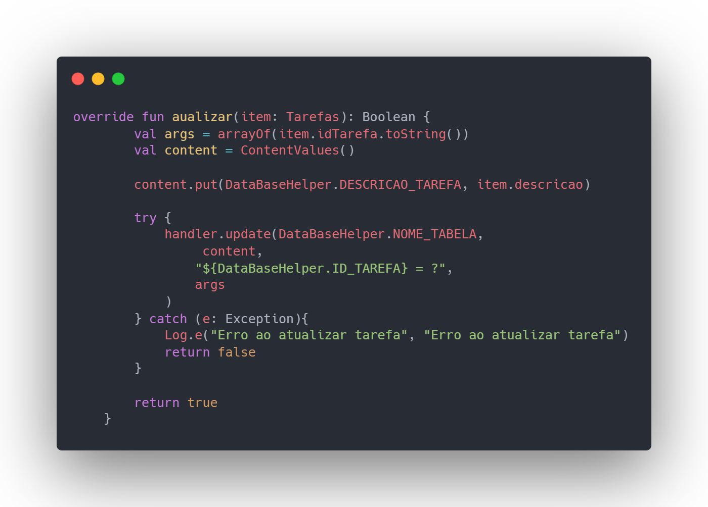
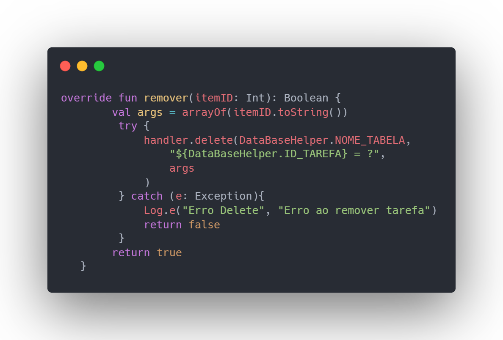

  <h1> Lista de Tarefas para Android usando Kotlin </h1>

## Tecnologias Utilizadas

## Recursos

- Adicionar, remover e atualizar itens por meio do SQLite
- Interação com Views mais eficiente utilizando o ViewBinding
- Utilização de RecyclerView para listgem de Tarefas
- Adapter customizado para realizar a configuração da interação com as Tarefas
- Gerenciamento de métodos SQL utilizando o SQLiteOpenHelper

# Desenvolvimento
  Está aplicação foi desenvolvida utilizando a metodologia Data Access Object onde facilita a reutilização e viabilidade do código e facilitando sua manutenção. Para primeiro recurso foram utilizado recurso ViewBinding para a manipulação de elementos
  em cada activity.

  ## RecyclerView e Adapter
  Foram criadas duas activities para a transição de telas no código. A MainActivity é responsável por carregar um RecyclerView e exibir as tarefas recuperadas do banco de dados. Para isso, foi criado um TarefaAdapter que gerencia o layout das tarefas recuperadas.

  
A criação do Adapter inclui um ViewHolder, que gerencia os elementos e configura os valores a serem passados entre as activities. Diferentemente da criação tradicional do ViewHolder utilizando view: Viewer, neste projeto foi utilizado o recurso de binding, herdado de ItemTarefaBinding. O ItemTarefaBinding é gerado pelo RecyclerView e realiza o encadeamento do layout com a classe correspondente, eliminando a necessidade de referenciar diretamente o XML. Em seguida, ele infla o layout para adaptá-lo à tela através do Parent.

## Gerenciamento do Banco de Dados (SQLiteHelper)

Para a criação do banco de tarefas foi utilziado o SQLiteHelper do Android o qual realiza um suporte para a criação de tabelas e a execução de querys diretamente no código, para isso, foi criada uma classe DataBaseHelper a qual implementa a interface SQLiteHelper, esta classe além de criar a tabela também fornece suporte para a classe de execução TarefasDAO, essa classe implementa duas partes importantes, um handler(executor) e um reader(leitor) que ficam como parte de uma parte da abstração das funções do DataBaseHelper.

 

## Adicionando Tarefas
Para a adição de tarefas ao banco de dados foi utilizado a função handler.put() a qual faz a adaptação da Query "INSERT VALUES INTO" do SQL.

 

### Detalhamento

#### Parâmetro item:

- O parâmetro item é uma instância da classe Tarefas que contém os dados da tarefa a ser salva no banco de dados.
ContentValues:

- ContentValues é utilizado para armazenar pares chave-valor. Neste caso, ele armazena a descrição da tarefa.
values.put("descricao", item.descricao) insere o valor da descrição da tarefa no ContentValues com a chave "descricao".
Bloco try-catch:

- O bloco try tenta inserir os dados da tarefa no banco de dados.

- handler.insert(DataBaseHelper.NOME_TABELA, null, values) insere os dados no banco de dados na tabela especificada por DataBaseHelper.NOME_TABELA.
Se a inserção for bem-sucedida, uma mensagem de log de sucesso é registrada: Log.v("Cadastrar Tarefa", "Tarefa Cadastrada com Sucesso").

#### Tratamento de Exceção:
- Se ocorrer uma exceção durante a inserção, o bloco catch captura a exceção.
Uma mensagem de erro é registrada: Log.e("Cadastrar Tarefa", "Erro ao cadastrar tarefa ${e.message}").
- A função retorna false, indicando que a operação de salvamento falhou.
- Se a operação de salvamento for bem-sucedida, a função retorna true.

## Atualizando Tarefas
Para a atualização de tarefas ao banco de dados foi utilizado a função handler.update() a qual faz a adaptação da Query "UPDATE SET" do SQL.

 

#### Detalhamento

- Args é um array de strings contendo o ID da tarefa a ser atualizada, convertido para string.
ContentValues content:

- Um objeto ContentValues é instanciado para armazenar os novos valores da tarefa.
content.put(DataBaseHelper.DESCRICAO_TAREFA, item.descricao) atualiza o valor da descrição da tarefa no ContentValues.
Bloco try-catch:

- O bloco try tenta executar a atualização dos dados no banco de dados.

- handler: Uma instância de SQLiteDatabase que gerencia o banco de dados.
DataBaseHelper.NOME_TABELA: Nome da tabela onde os dados serão atualizados.
content: ContentValues contendo os novos valores da tarefa a serem atualizados.
"${DataBaseHelper.ID_TAREFA} = ?": Condição WHERE que especifica qual tarefa deve ser atualizada, baseada no ID.
args: Array de argumentos que substituem o placeholder na condição WHERE.

#### Logging e Retorno:

- Se a atualização for bem-sucedida, a função retorna true.
- Em caso de exceção durante a atualização, o bloco catch captura a exceção e registra uma mensagem de log de nível ERROR indicando o erro específico.
A função retorna false se ocorrer algum erro durante a atualização.

## Removendo Tarefas
Para a remoção de tarefas ao banco de dados foi utilizado a função handler.remove() a qual faz a adaptação da Query "DELETE FROM" do SQL.

 

### Detalhamento

- Args é um array de strings contendo o ID da tarefa a ser removida, convertido para string.
Bloco try-catch:

- O bloco try tenta executar a remoção dos dados no banco de dados.
  
- handler: Uma instância de SQLiteDatabase uma classe que gerencia o banco de dados.
- DataBaseHelper.NOME_TABELA: Nome da tabela onde os dados serão removidos.
"${DataBaseHelper.ID_TAREFA} = ?": Condição WHERE que especifica qual tarefa deve ser removida, baseada no ID.
args: Array de argumentos que substituem o placeholder na condição WHERE.

### Logging e Retorno:

- Se a remoção for bem-sucedida, a função retorna true.
- Em caso de exceção durante a remoção, o bloco catch captura a exceção e registra uma mensagem de log de nível ERROR indicando o erro específico.
A função retorna false se ocorrer algum erro durante a remoção.

## Acompanhe o desenvolvimento desta e outras aplicações em

  

<h1 align="center">
   Desenvolvido por Rhyan Araujo Chaves @2024
</h1>

