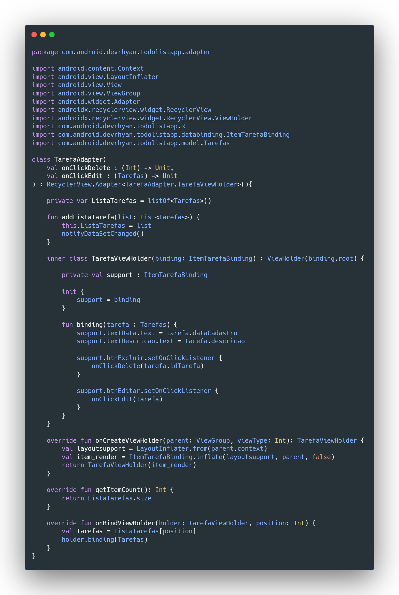
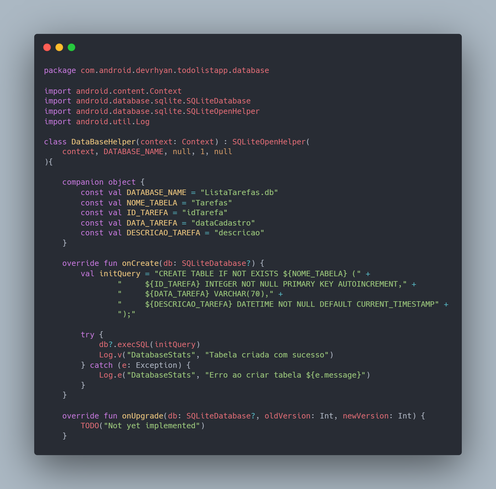

  <h1> Lista de Tarefas para Android usando Kotlin </h1>

## Tecnologias Utilizadas

## Recursos

- Adicionar, remover e atualizar itens por meio do SQLite
- Interação com Views mais eficiente utilizando o ViewBinding
- Utilização de RecyclerView para listgem de Tarefas
- Adapter customizado para realizar a configuração da interação com as Tarefas
- Gerenciamento de métodos SQL utilizando o SQLiteOpenHelper

# Desenvolvimento
  Está aplicação foi desenvolvida utilizando a metodologia Data Access Object onde facilita a reutilização e viabilidade do código e facilitando sua manutenção. Para primeiro recurso foram utilizado recurso ViewBinding para a manipulação de elementos
  em cada activity.

  ## RecyclerView e Adapter
  Foram criadas duas activities para a transição de telas no código. A MainActivity é responsável por carregar um RecyclerView e exibir as tarefas recuperadas do banco de dados. Para isso, foi criado um TarefaAdapter que gerencia o layout das tarefas recuperadas.

  
A criação do Adapter inclui um ViewHolder, que gerencia os elementos e configura os valores a serem passados entre as activities. Diferentemente da criação tradicional do ViewHolder utilizando view: Viewer, neste projeto foi utilizado o recurso de binding, herdado de ItemTarefaBinding. O ItemTarefaBinding é gerado pelo RecyclerView e realiza o encadeamento do layout com a classe correspondente, eliminando a necessidade de referenciar diretamente o XML. Em seguida, ele infla o layout para adaptá-lo à tela através do Parent.

 

## Gerenciamento do Banco de Dados (SQLiteHelper)

Para a criação do banco de tarefas foi utilziado o SQLiteHelper do Android o qual realiza um suporte para a criação de tabelas e a execução de querys diretamente no código, para isso, foi criada uma classe DataBaseHelper a qual implementa a interface SQLiteHelper, esta classe além de criar a tabela também fornece suporte para a classe de execução TarefasDAO, essa classe implementa duas partes importantes, um handler(executor) e um reader(leitor) que ficam como parte de uma parte da abstração das funções do DataBaseHelper.

 

## Acompanhe o desenvolvimento desta e outras aplicações em

  

<h1 align="center">
   Desenvolvido por Rhyan Araujo Chaves @2024
</h1>

